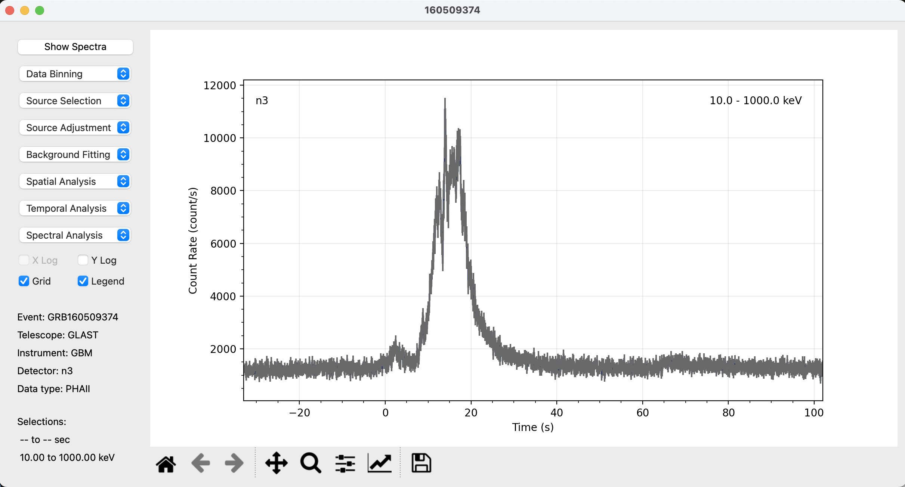
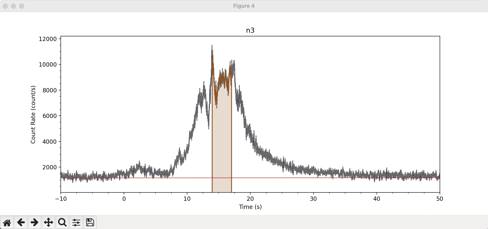
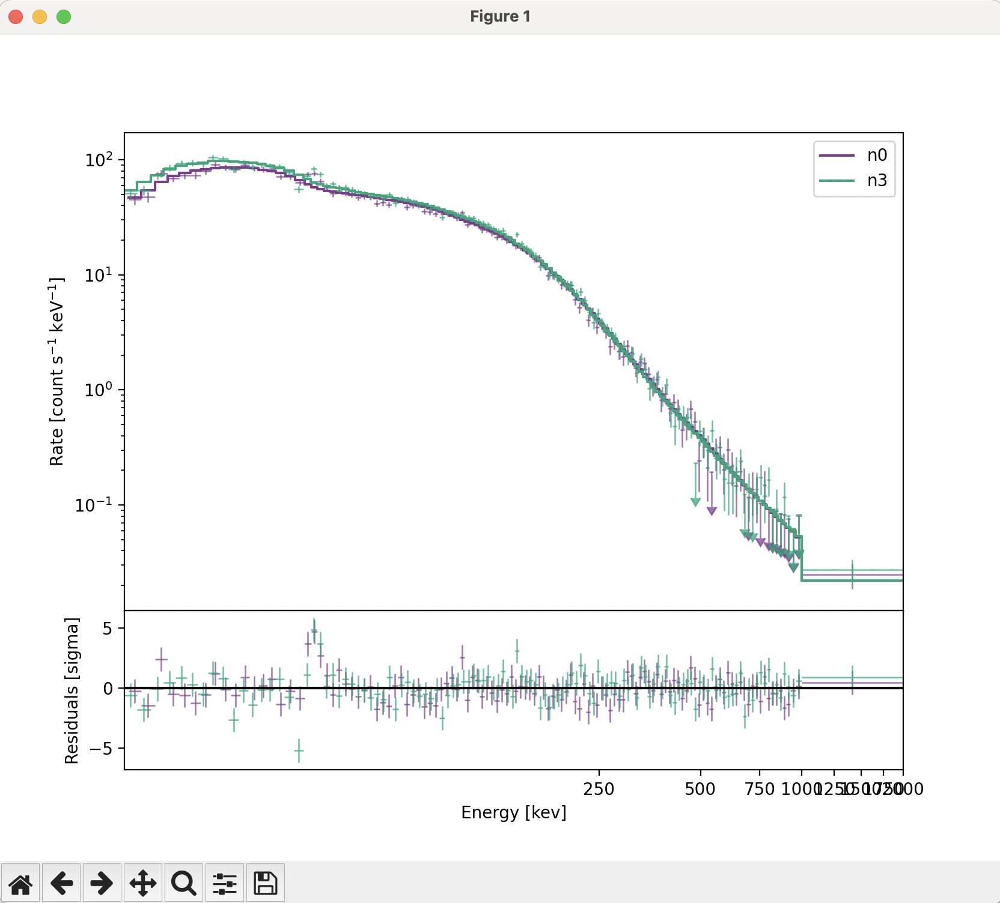
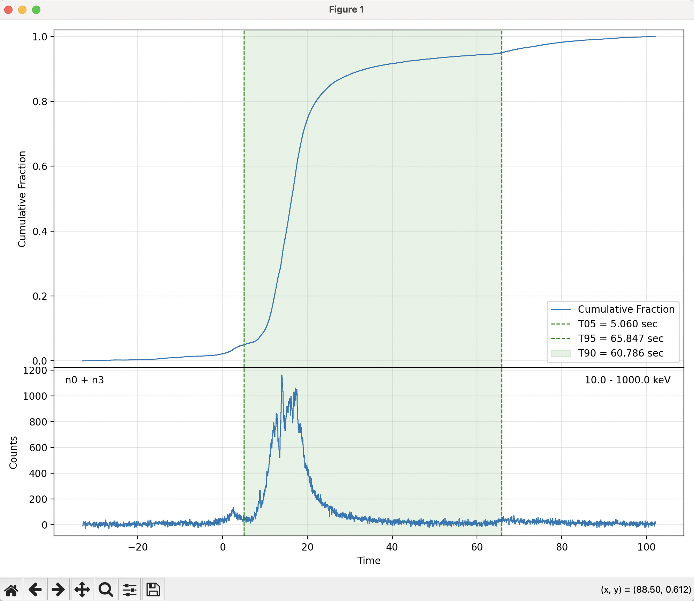
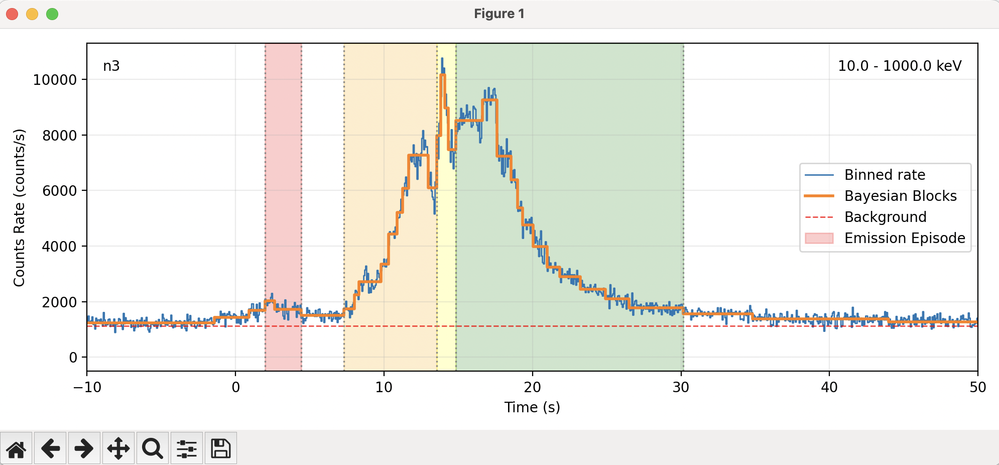
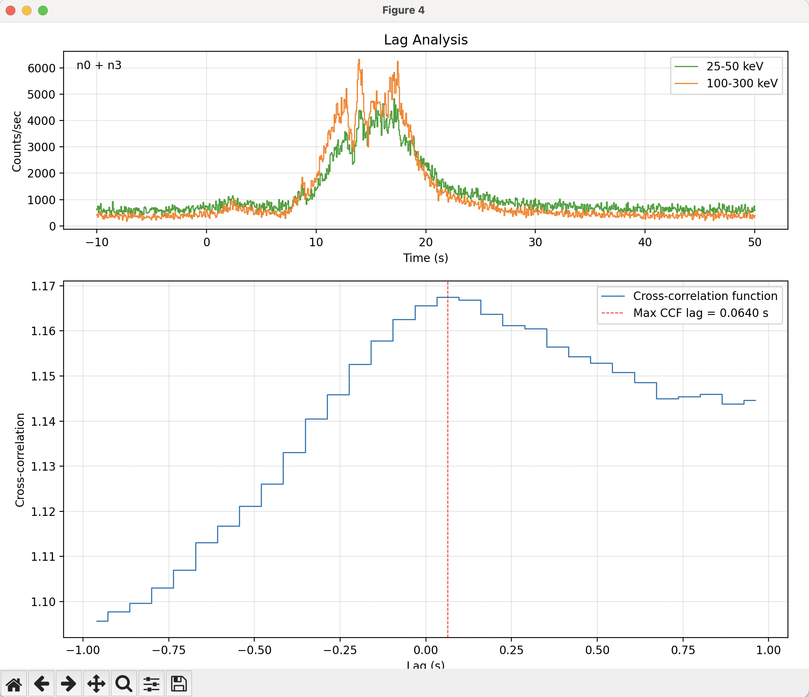
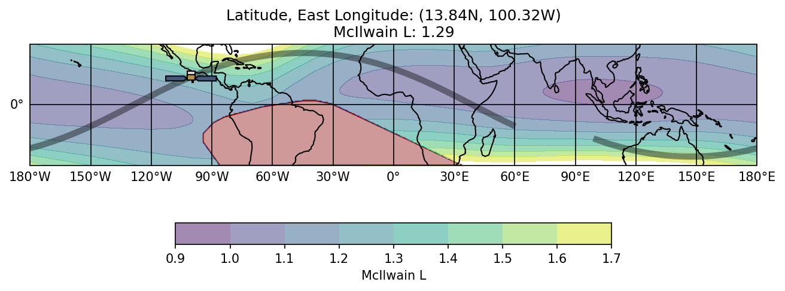

# SPECTER

The Spectral and Temporal analysis for Energetic Radiation (SPECTER) toolkit is a graphical user interface (GUI) to the **Gamma-ray Data Tools (GDT)**. It provides a single high-level `GRB` class that wraps data I/O, background modeling, light-curve and spectral analysis, and common GRB analysis routines. 

The toolkit it built on PyQt to support interactive selections and visualization. The GUI windows and command line interface (CLI) can work simultaneously, with edits made in the CLI being reflected immediately in the GUI. 

SPECTER is intended to be a replacement to the venerable RMFIT spectral fitting package and supercedes the GSpec software package.

## Key capabilities
- Load GBM **TTE**, **CSPEC**, and **CTIME** products
- Manage detector collections (NaI/BGO) and response files (RSP2)
- Background fitting and interactive background/source selection
- Light-curve plotting and stacking
- Spectral fitting with common models and statistics (PG-Stat/C-Stat/Chi-square)
- T90 estimation, Bayesian blocks, structure function, and hardness ratios
- Orbital/geometry utilities (detector angles, SAA timing, localization plots)
- Quasi-periodic search utilities
- Spectral line search utilities
- Energetics calculations: **$E_{\rm iso}$** and **$L_{\rm iso}$**

## Installation
SPECTER is a lightweight repo without a packaging setup yet. Install the required dependencies in your environment first, then use the module directly.

Minimum dependencies used by the code:
- Gamma-ray Data Tools (GDT): `gdt-core`, `gdt-fermi`
- `numpy`, `scipy`, `matplotlib`
- `astropy`, `platformdirs`
- `PyQt6` (optional, for GUI tools)

Example (pip):

```bash
pip install gdt-core gdt-fermi numpy scipy matplotlib astropy platformdirs PyQt6
```
or simply:

```bash
pip install -r requirements.txt
```

### Optional: create a custom environment
You can isolate dependencies using a virtual environment before installing requirements.

**venv (Python built-in):**

```bash
python -m venv .venv
source .venv/bin/activate
pip install -r requirements.txt
```

**conda:**

```bash
conda create -n specter python=3.10
conda activate specter
pip install -r requirements.txt
```

**uv:**

```bash
uv venv .venv
source .venv/bin/activate
uv pip install -r requirements.txt
```

## Data directory configuration
SPECTER stores downloaded data using `platformdirs` by default.  The default `platformdirs` locations (app name: `specter`) are:
- macOS: `~/Library/Application Support/specter`
- Windows: `C:\\Users\\<user>\\AppData\\Roaming\\specter`
- Linux: `~/.local/share/specter`

You can override the default data directory in two ways:

1. **Environment variable**
   - `SPECTER_DATA_DIR=/path/to/data`
2. **Config file**
   - `~/.config/specter/config.json`
   - Example:
     ```json
     {"data_dir": "/path/to/data"}
     ```

## Quick start

```python
import specter

grb = specter.GRB("160509374")

# Download and load the tte data; the default binning is 0.064 sec
grb.load_tte(bin=True)

# Set the default view range
grb.view_range=(-33,102)

# Launch GUI windows (PHA viewers; FitPlotter if a spectral fitter exists)
grb.show_gui()

# Or open a single detector window
grb.show_gui(detector="n3")
```


> Tip: All of the analysis routines packaged with SPECTER can be performed either through the CLI or from the GUI windows.

## Background fitting
```python
import specter

# Create a GRB object
grb = specter.GRB("160509374")

# Load TTE data
grb.load_tte(bin=True)

# Define time ranges
grb.view_range=(-10,50)
grb.src_range = (14, 17)
grb.bkgd_range = [[(-150, -25), (100, 200)]]

# Fit background
grb.fit_backgrounds(order=1)
```


> Tip: Many methods are interactive and may open Qt or Matplotlib windows for selection and visualization.

## Spectral fitting
```python
import specter

# Create a GRB object
grb = specter.GRB("160509374")

# Load TTE data
grb.load_tte(bin=True)

# Define time ranges
grb.view_range=(-33,102)
grb.src_range = (14, 17)
grb.bkgd_range = [[(-150, -25), (100, 200)]]

# Fit background and spectra
grb.fit_backgrounds(order=1)
grb.fit_spectra(models=["band"], stat="PG-Stat")
```
<!--  -->


## T90 calculation
```
import specter

# Create a GRB object
grb = specter.GRB("160509374")

# Load TTE data
grb.load_tte(bin=True)

# Define time ranges
grb.view_range=(-33,102)
grb.src_range = (14, 17)
grb.bkgd_range = [[(-150, -25), (100, 200)]]

# Fit background
grb.fit_backgrounds(order=1)

# Calculate t90
grb.calc_t90()
```



## Energetics calculations
```
import specter

# Create a GRB object
grb = specter.GRB("160509374")

# Load TTE data
grb.load_tte(bin=True)

# Define time ranges
grb.view_range=(-33,102)
grb.src_range = (14, 17)
grb.bkgd_range = [[(-150, -25), (100, 200)]]

# Fit background and spectra
grb.fit_backgrounds(order=1)
grb.fit_spectra(models=["band"], stat="PG-Stat")

# Calcualte t90 and the k-corrected Eiso
grb.calc_t90()
eiso = grb.calc_eiso(redshift=1.23)
```

## Bayesian blocks example

```python
import specter


grb = specter.GRB("160509374")

# Load and bin TTE data (Bayesian blocks expects evenly binned data)
grb.load_tte(bin=True, resolution=0.064)

# Set the default view range
grb.view_range=(-10,50)

# Run Bayesian blocks on a detector and show the plot
grb.bayesian_blocks(detector="n3", p0=0.05, show_plot=True, show_episodes=True)
```


## Lag analysis example

```python
import specter

grb = specter.GRB("160509374")

# Load and bin TTE data (Bayesian blocks expects evenly binned data)
grb.load_tte(bin=True, resolution=0.064)

# Set the default view range
grb.view_range=(-10,50)

# Fit background and spectra
grb.bkgd_range = [[(-150, -25), (100, 200)]]
grb.fit_backgrounds(order=1)

# Perform a lag analysis between the 25-50 keV and 100-300 keV light data
grb.lag_analysis(analysis_range=(-10,50), lag_range=[-1,1], low_energy=(25, 50), high_energy=(100, 300))
```


## Fermi orbit plot example

```python
import specter

grb = specter.GRB("160509374")

# Plot the spacecraft orbit around the trigger time
grb.plot_orbit()

# Optionally save the plot to the data directory
grb.plot_orbit(save=True)
```


## Repository layout
- **specter.py** — primary `GRB` class and core analysis routines
- **analysis/** — algorithms (Bayesian blocks, structure function, FFT tools, energetics)
- **gui/** — PyQt widgets for interactive fitting/selection

## Notes
- The code relies on GDT’s Fermi/GBM support for file handling and response data.
- Some plots and GUI tools require a working Qt backend.

## License
Apache License 2.0. See [license.txt](license.txt).
